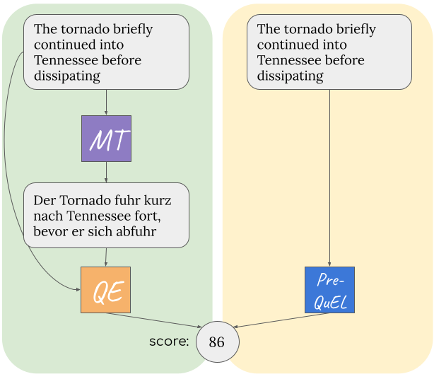

# PreQuEL: Quality Estimation of Machine Translation Outputs in Advance

<p align="center">
  
</p>

We present the task of PreQuEL, Pre-(Quality-Estimation) Learning. A PreQuEL system predicts how well a given sentence will be translated, without recourse to the actual translation, thus eschewing unnecessary resource allocation when translation quality is bound to be low. 

Here we proveide our baseline models for the task.

Paper link: https://arxiv.org/abs/2205.09178

---

## Install
```bash
git clone https://github.com/shachardon/PreQuEL.git
cd PreQuEL
pip install -e requirements.txt
```

---

## Quick Start - Train

To train a model, please run this command from the root directory of PreQuEL.

```bash
python run_model.py --model_type <type> --epochs <num_epochs> --folds <num_folds> --replace_comet --extra_finetune <num_extra_epochs> --dir <output_dir> --lang <lang>
```

- **--model_type** simple/combined/multiple

- **--epochs** Number of epochs to train the model on. Note that this is the maximum number of epochs. If the model do not improve for more than 10 evaluation steps, it stops training. 

- **--folds** Number of folds to run.
- 
- **--replace_comet** Set if you want to train on the COMET augmented data instead of on the DA data.

- **--extra_finetune** Train another <num_extra_epochs> epochs on the DA data (usually used after training on the COMET augmented data with the **--replace_comet** flag).

- **--dir** Directory path for saving the models and results.

- **--lang** de for en-de, en for de-en, et for et-en, zh for en-zh.
  
For example, 
```bash
python run_model.py --model_type simple --epochs 3 --folds 3 --extra_finetune 3 --replace_comet --dir output_dir_simple_exp_en_de --lang de
```

Will train a SimpleModel on the en-de pair, for 3 folds, each with 3 epochs on the COMET augmentations and then more 3 epochs on the DA data. The resulted models and test performance will be saved to a folder named 'output_dir_simple_exp_en_de'.

---
 
## Test
 
To test an existing model, run this command - 
```bash
python run_model.py --model_type simple --epochs <num_epochs> --folds  <num_folds> --extra_finetune <num_extra_epochs> --dir <experiment_dir_with_saved_models> --lang <lang> --test_only <test_file_path>
```

Where the test file is a text file with one source sentence per line.
**--epochs** should be set to 0, if you want to use the best saved model. Otherwise, the model from the <num_epochs> epoch will be used to make the predictions.

for example,

```bash
python run_model.py --model_type simple --epochs -1 --extra_finetune -1 --folds  3 --dir saved_models/simple_en_de_DA_with_comet/ --lang de --test_only data/newstest2020.ende.chrf.ngram.lan.comet.bertScore.test
```

Will use the already trained simple_en_de_with_comet model to perdict the DA scores for newstest2020.ende test data.
Note that you first need to unzip the saved models.

---

---

# Citation

```bibtex
@inproceedings{don-yehiya-etal-2022-prequel,
    title = "{P}re{Q}u{EL}: Quality Estimation of Machine Translation Outputs in Advance",
    author = "Don-Yehiya, Shachar  and
      Choshen, Leshem  and
      Abend, Omri",
    editor = "Goldberg, Yoav  and
      Kozareva, Zornitsa  and
      Zhang, Yue",
    booktitle = "Proceedings of the 2022 Conference on Empirical Methods in Natural Language Processing",
    month = dec,
    year = "2022",
    address = "Abu Dhabi, United Arab Emirates",
    publisher = "Association for Computational Linguistics",
    url = "https://aclanthology.org/2022.emnlp-main.767/",
    doi = "10.18653/v1/2022.emnlp-main.767",
    pages = "11170--11183",
    abstract = "We present the task of PreQuEL, Pre-(Quality-Estimation) Learning. A PreQuEL system predicts how well a given sentence will be translated, without recourse to the actual translation, thus eschewing unnecessary resource allocation when translation quality is bound to be low. PreQuEL can be defined relative to a given MT system (e.g., some industry service) or generally relative to the state-of-the-art.From a theoretical perspective, PreQuEL places the focus on the source text, tracing properties, possibly linguistic features, that make a sentence harder to machine translate.We develop a baseline model for the task and analyze its performance. We also develop a data augmentation method (from parallel corpora), that improves results substantially. We show that this augmentation method can improve the performance of the Quality-Estimation task as well.We investigate the properties of the input text that our model is sensitive to, by testing it on challenge sets and different languages. We conclude that it is aware of syntactic and semantic distinctions, and correlates and even over-emphasizes the importance of standard NLP features."
}
```

